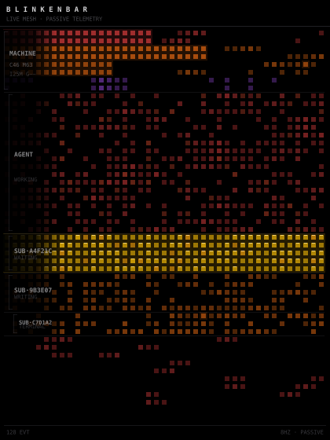
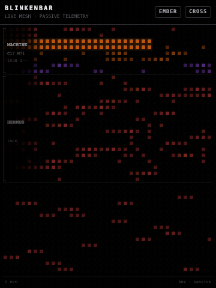
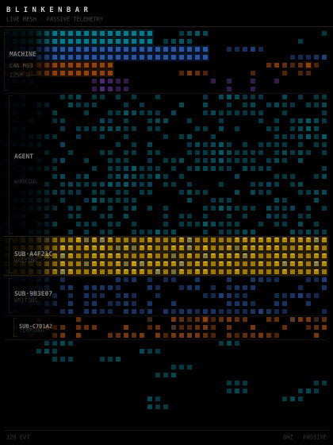
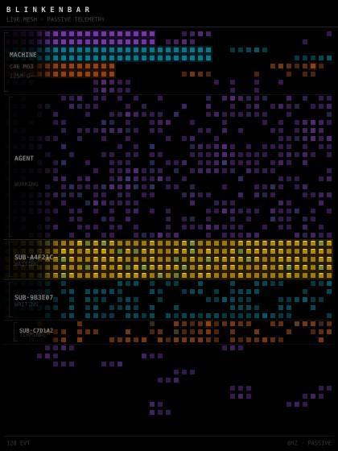
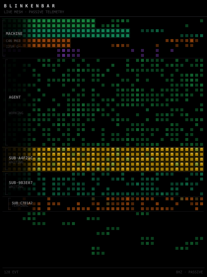
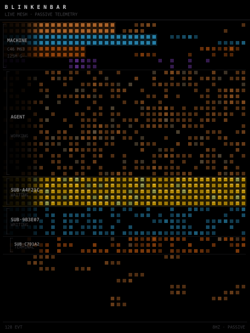
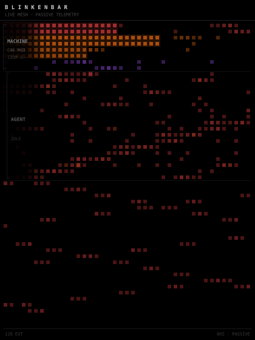

# Blinkenbar

Blinkenbar is a low-overhead, local-first activity display for Hermes Desktop. It turns system utilization and Hermes gateway events into a compact bank of animated “blinkenlights,” making concurrent agent work legible without opening logs or exposing prompt content.

## Screenshots

All media below is rendered by `scripts/media/` from the shipped renderer with a fully synthetic roster — real output, no live session data.





Color modes and the quiet idle state:

| EMBER | ION | VIOLET |
|---|---|---|
|  |  |  |
| **MATRIX** | **THEME** | **QUIET** |
|  |  |  |

Regenerate the media after any renderer change with `scripts/media/render.js` (see the Testing section).

## Features

- Live CPU, memory, disk-I/O, and optional NVIDIA GPU activity.
- Animated banks for the active agent, additional sessions, and nested subagents.
- Activity classification for thinking, reading, writing, browsing, terminal, media, planning, waiting, completion, and errors.
- Five color modes and four ambient patterns, stored locally per plugin.
- Generic `AGENT` identity by default, with an optional local custom label.
- Click-to-inspect summaries, a status-bar activity chip, and a built-in signal test.
- Visibility-aware rendering and polling; no background sampler or outbound telemetry.

## Architecture

Blinkenbar is a unified Hermes plugin:

```text
blinkenbar/
├── plugin.yaml                 Agent-plugin metadata
├── __init__.py                 Tool-free Python registration surface
├── dashboard/
│   ├── manifest.json           Dashboard API registration
│   └── plugin_api.py           FastAPI metrics endpoint
└── desktop/
    └── plugin.js               Desktop pane, reducer, renderer, and commands
```

The desktop component listens to local Hermes gateway events through `host.onEvent`, renders a canvas at up to 8 Hz while visible, and polls its namespaced `/metrics` endpoint every two seconds while the pane is active. The API samples system counters only when requested. The plugin registers no model-callable tools.

## Install and enable

Prerequisites:

- A Hermes release that supports unified desktop plugins.
- Hermes Desktop.
- Python packages `fastapi` and `psutil` in the Hermes runtime.
- Optional: an NVIDIA driver exposing NVML on Windows for GPU telemetry.

Install the unified package:

```bash
hermes plugins install cygnostik/Hermes-Plugin-Blinkenlights
hermes plugins doctor blinkenbar --ci
```

Note: some Hermes source scanners flag this package `CAUTION` because it observes approval/secret-request event names and keeps bounded in-memory profile/session state. The package is reviewed and secret-scanned; if your install path requires `--force`, reserve it for this repository or a fork you have verified yourself.

1. Set the target Hermes home for the intended profile. The default is `~/.hermes`; named profiles normally use `~/.hermes/profiles/<profile>`.
2. If Git installation is unavailable, copy this complete directory to `$HERMES_HOME/plugins/blinkenbar` without separating `desktop/` from the Python files.
3. Run `hermes plugins enable blinkenbar`, then open **Hermes Desktop → Settings → Plugins** and enable **Blinkenbar**. Unified desktop plugins are opt-in, and enabling the package must also permit its Python backend.
4. Use **Reload desktop plugins** from the command palette if hot reload does not occur.
5. Run `hermes plugins doctor --ci "$HERMES_HOME/plugins/blinkenbar"` and then **Blinkenbar: Run live signal test** from the command palette. Use `hermes doctor` separately for a full Hermes environment diagnosis; depending on configuration, it may perform provider connectivity checks.

To remove it, disable Blinkenbar in Settings before deleting `$HERMES_HOME/plugins/blinkenbar`.

## Configuration

| Setting | Default | How to change |
|---|---:|---|
| Agent label | `AGENT` | Run **Blinkenbar: Configure agent label**. Empty input resets the generic label. |
| Color mode | `EMBER` | Click the mode control: EMBER, ION, VIOLET, MATRIX, THEME. |
| Ambient pattern | `CROSSWASH` | Click the pattern control: CROSSWASH, STOCHASTIC, SHIFT, QUIET. |
| Pane placement | Right of workspace | Drag or dock the pane using Hermes Desktop layout controls. |

Preferences are stored through the plugin-scoped `ctx.storage` API. Profile names are not displayed as the primary identity. The in-memory roster is capped at 18 entries using deterministic eviction that preserves the focused primary entity. Completed subagent rows remain briefly to make transitions visible.

## Permissions and privacy

Blinkenbar reads local gateway event metadata needed to classify activity: event type, tool name, status, model label, short session/subagent identifiers, and goal or preview text capped at 48 characters. Goal and preview metadata are redacted from retained rows when work completes or errors. They can appear in a local click notification while work is live; do not use the pane during screen sharing if that metadata is sensitive.

The metrics API reads aggregate CPU, memory, disk, and GPU counters. Component sampling failures produce a stable degraded payload with zero/unavailable values rather than failing the endpoint. It does not read file contents, prompts, credentials, environment secrets, browser data, or network traffic. There is no analytics SDK, remote endpoint, account, telemetry upload, or background worker. Data remains in memory except plugin preferences stored by Hermes. The renderer stops painting when hidden, and metric polling is disabled in the background.

## Platform behavior

- **macOS/Linux/Windows:** CPU, memory, and disk counters use `psutil`.
- **Windows:** NVIDIA GPU utilization and memory are read only from the absolute `nvml.dll` path reported for the Windows system directory, using restricted system-directory loader flags.
- **macOS/Linux:** GPU telemetry is not available in this release; the UI shows `--` rather than guessing.
- **Disk activity:** native `busy_time` is preferred. If a driver omits it, Blinkenbar uses a conservative byte-rate animation proxy; this is an activity indicator, not a throughput benchmark.
- **Remote gateways:** gateway event display follows Hermes. The plugin metrics API describes the machine hosting the enabled backend, not necessarily the operator’s desktop.

## Testing

From the package root:

```bash
./scripts/verify.sh
```

The script runs JavaScript syntax and reducer tests, Python bytecode compilation and unit tests, a metrics smoke call, metadata validation, marker/secret-pattern scans, and the offline `hermes plugins doctor --ci` package check when Hermes is installed. A visual check should also confirm theme switching, pane resizing, all color/pattern modes, the identity command, status chip, signal test, offline recovery, and GPU-unavailable rendering.

## Release media

`scripts/media/` renders the README screenshots and demo GIF straight from `desktop/plugin.js` (it slices the pure canvas renderer into a node-canvas harness) with a synthetic roster and theme, so media always matches the shipped code and never contains live session data.

```bash
cd scripts/media
npm install
node extract-renderer.js
node render.js shot docs/media/blinkenbar-hero.png EMBER CROSSWASH 6.5 420x560
node render.js frames /tmp/blinkenbar-frames 8 12 EMBER CROSSWASH 360x480
```

Then encode the frames into a GIF with ffmpeg (two-pass palette method), and rerun the mode variants for ION, VIOLET, MATRIX, and THEME.

## Dependencies

Runtime dependencies are Hermes Desktop, `@hermes/plugin-sdk`, React (provided by Hermes), FastAPI, and psutil. NVIDIA NVML is optional and dynamically loaded; it is not bundled. See [THIRD_PARTY_NOTICES.md](THIRD_PARTY_NOTICES.md).

## Credits

Chris M.  
ProDyn.ai / Promethean Dynamic  
chrism@promethean-dynamic.com

The visual concept is inspired by the blinkenlight aesthetic demonstrated by Boz Brown in [this video](https://www.youtube.com/watch?v=vKjqw5iGqnQ). Boz Brown is not affiliated with, a contributor to, or an endorser of Blinkenbar.

## Support and status

For support or security coordination, contact `chrism@promethean-dynamic.com` or open an issue. See [CHANGELOG.md](CHANGELOG.md) and [SECURITY.md](SECURITY.md).

## License

MIT — see [LICENSE](LICENSE).
