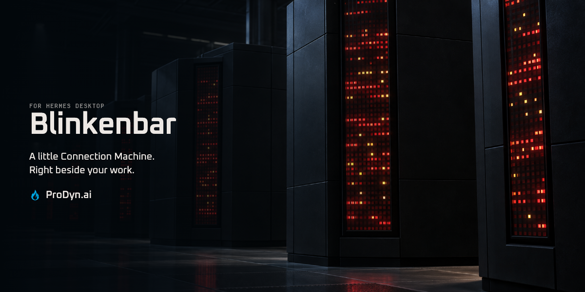
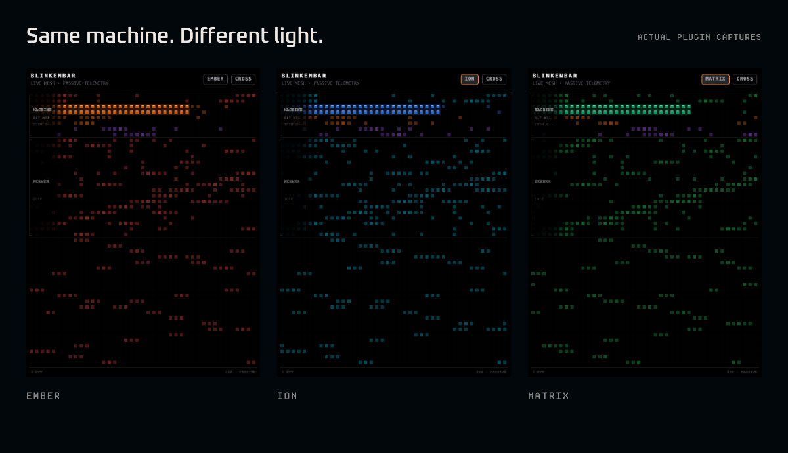

# Blinkenbar

A little Connection Machine beside your work. CM-5-inspired lights for Hermes Desktop, driven by system counters and agent activity.



## For the love of the lights

Black cabinets. Dense red lamps. The unmistakable theatre of Thinking Machines’ [Connection Machine CM-5](https://people.csail.mit.edu/bradley/cm5/). That’s the inspiration—not another dashboard full of charts.

*Header: CM-5-inspired artwork. Real plugin captures below.*

## Your machine, in lights

CPU, memory and disk activity feed the system banks. Agent events change the color and pulse of the agent banks. Idle patterns keep the panel alive between jobs.



Five palettes: **EMBER · ION · VIOLET · MATRIX · THEME**. Four patterns: **CROSSWASH · STOCHASTIC · SHIFT · QUIET**.

The lights interpret activity; individual lamps aren’t registers or a progress bar. Ambient movement doesn’t mean an agent is working.

## Put it beside your work

Requires Hermes Desktop with unified-plugin support, plus FastAPI and psutil in its Python runtime.

```bash
hermes plugins install cygnostik/Hermes-Plugin-Blinkenlights
hermes plugins enable blinkenbar
hermes plugins doctor --ci blinkenbar
```

Enable **Blinkenbar** in **Settings → Plugins**. If needed, run **Reload desktop plugins** from the command palette. The pane docks on the right; move it with Hermes’s layout controls. Use **EMBER** and **CROSS** to cycle the palette and pattern.

Keep the Python backend and desktop pane together. Review any scanner findings; the observed `sudo.request` event indicates waiting and does not invoke sudo.

## Quiet about your data

No analytics uploads or model calls. Blinkenbar reads aggregate counters and activity metadata, not prompt bodies or file contents. Only presentation preferences are saved. With a remote gateway, counters describe that backend machine.

[Operation, platform support and development](OPERATIONS.md) · [Issues](https://github.com/cygnostik/Hermes-Plugin-Blinkenlights/issues) · [Security](SECURITY.md) · [Changelog](CHANGELOG.md)

*Product images use the real plugin in an isolated browser host, with an aggregate counter sample and an idle agent; no agent activity was injected.*

Made by **Chris M. · [ProDyn.ai](https://prodyn.ai)** / Promethean Dynamic. [MIT](LICENSE) · [Third-party notices](THIRD_PARTY_NOTICES.md).
